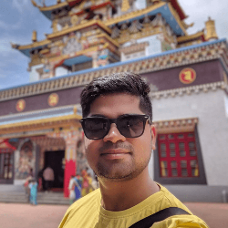

>  "recreating best of myself" 

I'm a 
- [**Web Developer**](https://dotnet.microsoft.com/apps/aspnet) (Web Apps • APIs • µ-services)
- [**Certified AWS Solutions Architect - Associate®**](https://www.credly.com/badges/8987c8e4-cd70-48f2-9017-9af4188c841d)
- [**Certified Scrum Master®**](https://bcert.me/bc/html/show-badge.html?b=zliglrhu)
living in Delhi and moving around NCR, India.

I'm passionate about web development and spend workdays with my hands in below areas of web development

- **Back-end** ( C# • Asp.Net • NodeJS )
- **Front-end** ( Angular • React )
- **Cloud** ( AWS • Azure )

Currently, I work with [Dell Technologies](dell.com). I'm not looking for any full-time position as of now. I'm always open to ideas and projects that excite me.
